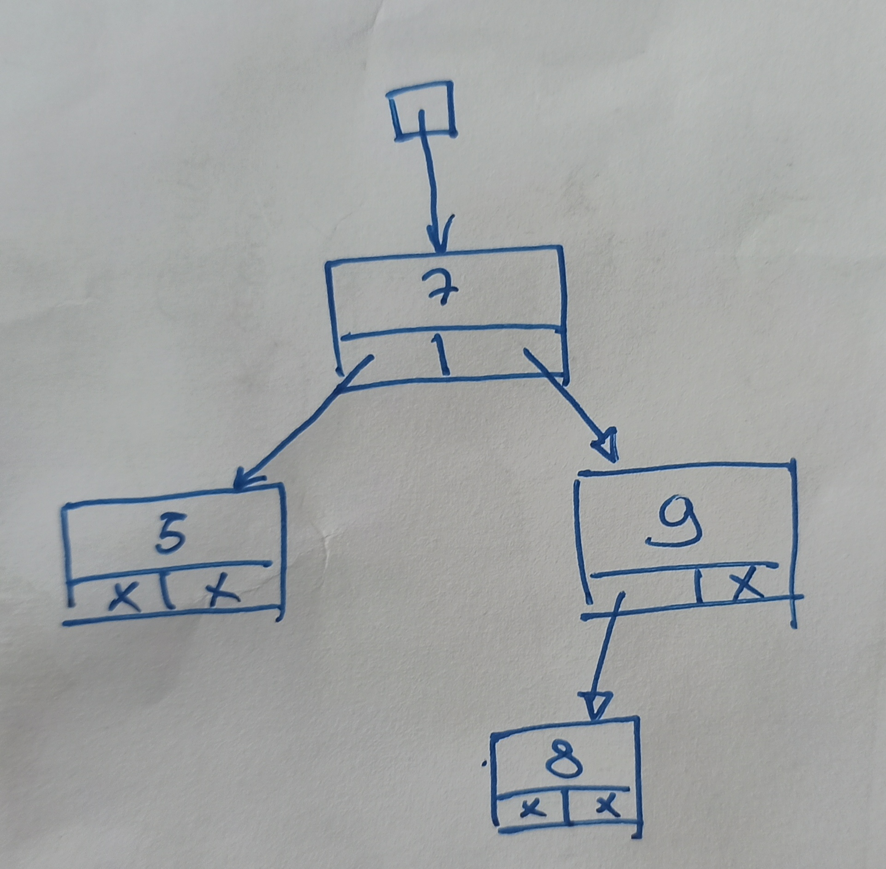

# Binary Tree

  

The binary tree is a structure composed of nodes. Each node do have two children:  

- The left one is smaller in comparaison to the parent node.
- The right one is greater in comparaison to the parent node.

For simplicity (and unity) we're gonna use int but you can define your own conditions too as long as it does fit this model.  

Binary tree interaction do use a lot of recursive command so we recommend you to learn how to use them before getting in it. However this is a good way to learn how it works !  

The size of a binary tree is the number of nodes he have, his height is how many levels he do have

We can go through a binary tree with different techniques:

- Prefix --> We do operation first on the current node, then on the left branch, then on the right branch (recursively)
- Infix  --> We do operation first on the left branch, then on the current node, then on the right branch (recursively)
- Suffix --> We do operation first on the left branch, then on the right branch, then on the current node (recursively)

## Data Structure Operation Complexity  

| Condition | Access    | Search    | Insertion | Deletion |
| --------- | --------- | --------- | --------- | -------- |  
| Average   | Θ(log(n)) | Θ(log(n)) | Θ(log(n)) | Θ(log(n))|
| Worst     | O(n)      | O(n)      | O(n)      | O(n)     |
