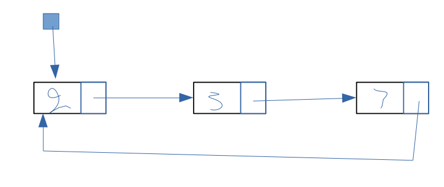

# Circular Linked List

  

The linked list is composed of node with one pointer to the next node, the last node is a pointer to the first node.  
The "linked list" object itself (The blue dot) is a pointer to the first node of the linked list.  
This way we can access both the end and the beginning of the list.  

## Data Structure Operation Complexity  

| Condition | Access | Search | Insertion | Deletion |
| --------- | ------ | ------ | --------- | -------- |  
| Average   | Θ(n)   | Θ(n)   | Θ(1)      | Θ(1)     |
| Worst     | O(n)   | O(n)   | O(1)      | O(1)     |
