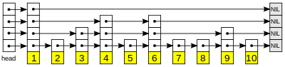

# Skip List

  

The skip list is composed of multiple node layers, the nodes are linked with different jump between the values so you can quickly find your desired value.  

## Data Structure Operation Complexity  

| Condition | Access | Search | Insertion | Deletion |
| --------- | ------ | ------ | --------- | -------- |  
| Average   | Θ(log(n))   | Θ(log(n))   | Θ(log(n))      | Θ(log(n))     |
| Worst     | O(n)   | O(n)   | O(n)      | O(n)     |
