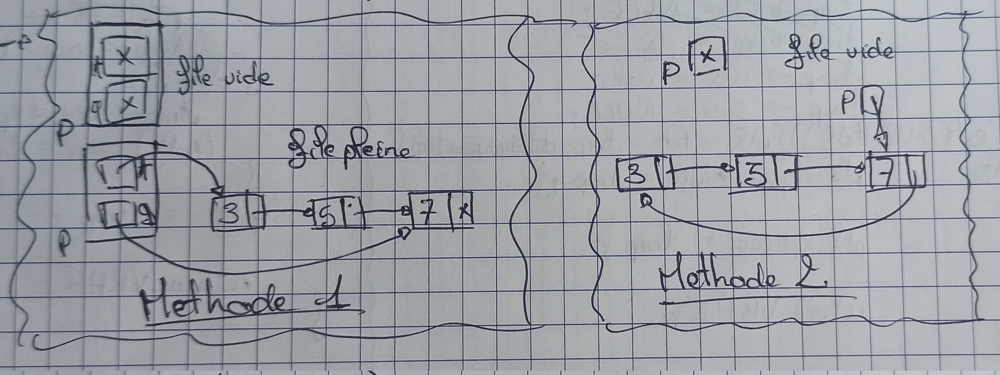

# Queue

  

The Queue follow the FIFO pattern: **First In First Out**
The Queue is composed of multiple nodes following themselves.
As we see on the picture, we can use different techniques (A circular linked list pointing on the last node Or a struct containing a pointer to the first and last node).

## Data Structure Operation Complexity  

| Condition | Access | Search | Insertion | Deletion |
| --------- | ------ | ------ | --------- | -------- |  
| Average   | Θ(n)   | Θ(n)   | Θ(1)      | Θ(1)     |
| Worst     | O(n)   | O(n)   | O(1)      | O(1)     |
